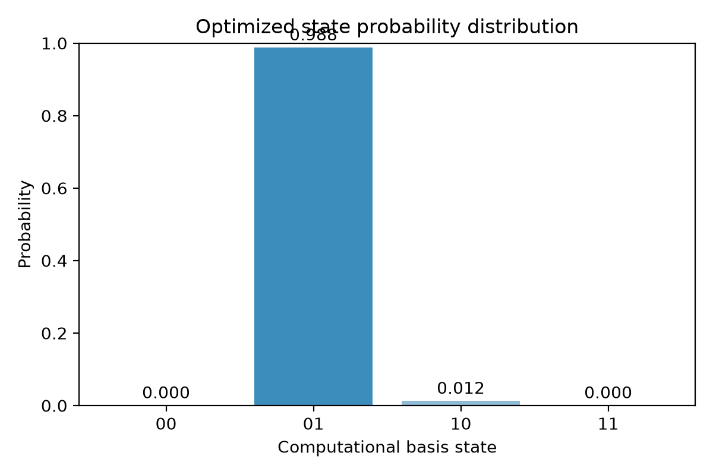
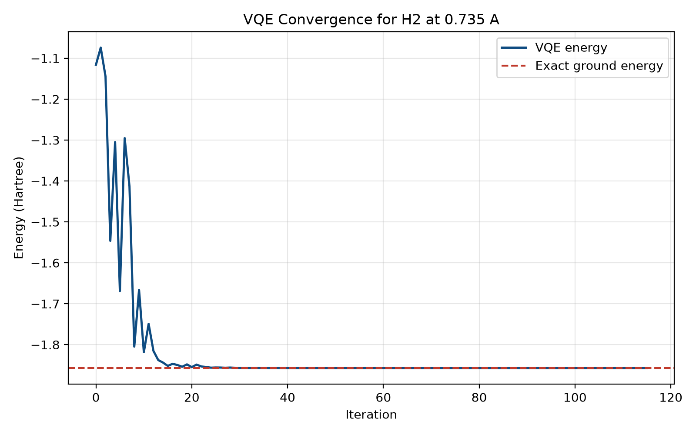
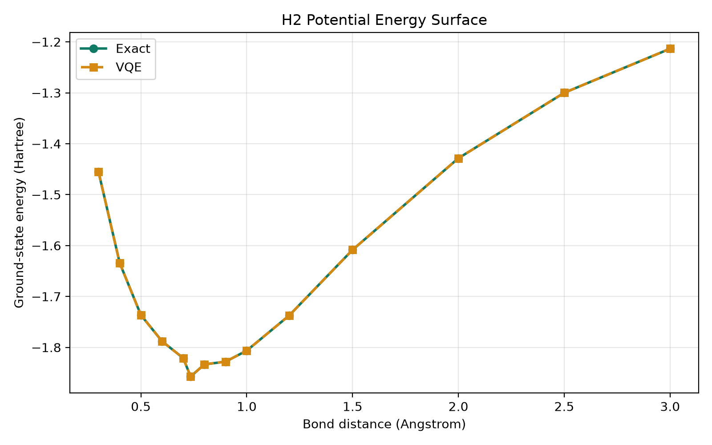

# Quantum Machine Learning (AIMLZG545)

## Assignment 2 Solution: Quantum Approach to a Classical Problem

**Student Name:** Ayushi Gupta  
**Student ID:** 2024AC05720

## Index

- [Assignment 2 Solution: Quantum Approach to a Classical Problem](#assignment-2-solution-quantum-approach-to-a-classical-problem)
- [Problem Chosen](#problem-chosen)
- [1. Problem Recap](#1-problem-recap)
- [2. Data Representation](#2-data-representation)
- [3. Quantum Model Design](#3-quantum-model-design)
- [4. Implementation and Results](#4-implementation-and-results)
- [5. Discussion and Limitations](#5-discussion-and-limitations)
- [6. References](#6-references)

## Problem Chosen

Following Assignment 1, I use the same classical problem: **molecular ground-state energy estimation for drug discovery**. The concrete quantum demonstration uses the hydrogen molecule (H2) as a minimal surrogate system, while the motivation remains the larger drug-discovery setting described in Assignment 1B.

---

## 1. Problem Recap

### What is the problem?

The task is to estimate the **ground-state energy** of a molecule, which is the minimum eigenvalue of its Hamiltonian $H$. In computational chemistry, this energy determines molecular stability, binding behavior, and reaction pathways. In drug discovery, accurate energy estimation is essential for predicting how candidate molecules interact with biological targets.

Mathematically, the problem is to solve:

$$
H |\psi\rangle = E |\psi\rangle
$$

and identify the minimum energy $E_0$.

### Why is it difficult classically?

This problem becomes hard because the Hilbert-space dimension grows exponentially with the number of electrons. A molecule with $n$ effective spin orbitals requires a state description over roughly $2^n$ basis states. Exact methods such as Full Configuration Interaction therefore become infeasible beyond very small systems.

This is directly relevant to drug discovery because realistic molecules and protein-ligand systems are far larger than what exact classical simulation can handle.

---

## 2. Data Representation

### Input features

For this assignment I use a small molecular dataset built from **14 H2 bond distances**. Each sample represents one molecular geometry. The features for each sample are:

- Bond distance $r$
- Hamiltonian coefficient for $II$
- Hamiltonian coefficient for $IZ$
- Hamiltonian coefficient for $ZI$
- Hamiltonian coefficient for $ZZ$
- Hamiltonian coefficient for $XX$

These coefficients define the 2-qubit Hamiltonian after Jordan-Wigner mapping:

$$
H = c_{II} II + c_{IZ} IZ + c_{ZI} ZI + c_{ZZ} ZZ + c_{XX} XX
$$

At the equilibrium geometry $r = 0.735$ Angstrom, the Hamiltonian used is:

$$
H = -1.0523732 II + 0.3979374 IZ - 0.3979374 ZI - 0.0112801 ZZ + 0.1809312 XX
$$

### How the data is represented in the quantum workflow

This solution uses a **Variational Quantum Circuit**. The molecular sample is specified classically through the Hamiltonian coefficients, and the quantum circuit prepares a trial wavefunction whose energy is measured against that Hamiltonian.

The circuit itself uses **angle encoding through trainable $R_y$ rotations**. The variational angles are optimized by a classical optimizer, so the encoded quantum state changes iteratively until the measured energy is minimized.

### Encoding method used

The encoding method is **angle encoding** because the circuit state is prepared using rotation angles in $R_y$ gates. The Hamiltonian coefficients are not amplitude-encoded; instead, they define the observable whose expectation value is measured.

---

## 3. Quantum Model Design

### Chosen model

I use a **Variational Quantum Circuit (VQC)** in the VQE style.

### Circuit architecture

The 2-qubit ansatz is:

```text
     ┌────────────┐     ┌────────────┐
q_0: ┤ Ry(2.9006) ├──■──┤ Ry(6.1925) ├
     ├────────────┤┌─┴─┐├────────────┤
q_1: ┤ Ry(5.9041) ├┤ X ├┤ Ry(2.7523) ├
     └────────────┘└───┘└────────────┘
```

The trainable structure before optimization is:

1. $R_y(\theta_0)$ on qubit 0
2. $R_y(\theta_1)$ on qubit 1
3. CNOT from qubit 0 to qubit 1
4. $R_y(\theta_2)$ on qubit 0
5. $R_y(\theta_3)$ on qubit 1

### Gates used

- $R_y$ rotation gates for parameterized state preparation
- CNOT for two-qubit entanglement

### How entanglement is introduced

Entanglement is introduced through the **CNOT** gate. This matters because molecular wavefunctions contain electron correlation, and a separable product state cannot model that correlation accurately.

### What is measured?

The measured quantity is the **expectation value of the Hamiltonian**:

$$
E(\theta) = \langle \psi(\theta) | H | \psi(\theta) \rangle
$$

The classical optimizer minimizes this value, and the lowest value approximates the molecular ground-state energy.

---

## 4. Implementation and Results

### Dataset description

- Dataset size: 14 molecular geometries
- System: H2 molecule mapped to 2 qubits
- Feature set: bond distance plus five Pauli-term coefficients
- Qubit count used: 2, which stays within the assignment limit of 6 qubits

### Implementation summary

I implemented the workflow in Qiskit as follows:

1. Build the 2-qubit Hamiltonian from Pauli coefficients.
2. Compute the exact ground-state energy by classical diagonalization.
3. Build a 4-parameter VQE ansatz.
4. Use COBYLA to minimize the Hamiltonian expectation value.
5. Repeat the process over multiple bond distances to obtain a potential-energy surface.

### Validated numerical results

For the equilibrium geometry $r = 0.735$ Angstrom:

- Exact ground-state energy: **-1.857275 Hartree**
- VQE ground-state energy: **-1.857275 Hartree**
- Absolute error: **0.00000000 Hartree**
- Optimizer evaluations: **116**

Optimized parameters:

$$
[2.900646, 5.904094, 6.192500, 2.752317]
$$

### Optimized-state probability distribution

The optimized quantum state has the following computational-basis probabilities:

- $P(00) = 0.000000$
- $P(01) = 0.987560$
- $P(10) = 0.012440$
- $P(11) = 0.000000$

The distribution plot is shown below:



### Loss vs iterations

The VQE loss curve is shown below:



Interpretation:

- The energy decreases over iterations as the classical optimizer updates the circuit parameters.
- Convergence to the exact line indicates that the ansatz is expressive enough for this 2-qubit problem.

### Potential energy surface

I also evaluated the method across 14 bond distances. The resulting potential-energy surface is shown below:



Key result:

- Lowest VQE energy: **-1.857275 Hartree** at **0.735 Angstrom**
- Lowest exact energy: **-1.857275 Hartree** at **0.735 Angstrom**
- Maximum absolute error across the 14-point curve: **0.00000000 Hartree**

Interpretation:

- The quantum model reproduces the exact potential-energy surface for this small example.
- The minimum occurs at the expected equilibrium distance, so the model captures the physically correct stable geometry.

### Final output/result

The final output is a quantum-estimated ground-state energy for each molecular geometry. In this implementation, the VQE result matches the exact ground-state energy for the 2-qubit H2 benchmark, demonstrating that the hybrid quantum-classical workflow is correct for a toy molecular system.

---

## 5. Discussion and Limitations

### Does the quantum approach provide any advantage?

For this specific 2-qubit H2 example, there is **no practical runtime advantage** over classical diagonalization because the Hamiltonian is only $4 \times 4$. However, the value of the approach is conceptual and architectural:

- It uses the same hybrid method intended for larger molecular systems.
- It represents wavefunctions natively in a quantum state space.
- It provides a pathway toward harder chemistry problems where classical exact methods fail.

### Limitations of this approach

This solution has several important limitations:

- The molecule is extremely small and does not represent the full complexity of drug molecules.
- The Hamiltonian coefficients are precomputed rather than generated within the workflow using a full chemistry stack.
- The simulation is noiseless, so it does not reflect real hardware behavior.
- The ansatz depth is shallow and tailored to a very small system.

### Effect of NISQ constraints

NISQ-era hardware would affect this workflow in several ways:

- **Noise:** expectation values become noisy, which can distort the optimizer landscape.
- **Limited qubits:** realistic drug-relevant molecules require far more than 2 qubits.
- **Circuit depth limits:** deeper ansatze needed for larger molecules may exceed coherence times.
- **Measurement overhead:** accurate energy estimation requires many repeated measurements.

So while this result is encouraging as a proof of concept, current NISQ devices are still far from solving production-scale drug-discovery chemistry.

---

## 6. References

1. Peruzzo, A. et al. "A variational eigenvalue solver on a photonic quantum processor." Nature Communications, 2014.
2. McArdle, S. et al. "Quantum computational chemistry." Reviews of Modern Physics, 2020.
3. Cao, Y. et al. "Quantum Chemistry in the Age of Quantum Computing." Chemical Reviews, 2019.
4. Qiskit documentation for `QuantumCircuit`, `SparsePauliOp`, and statevector simulation.
