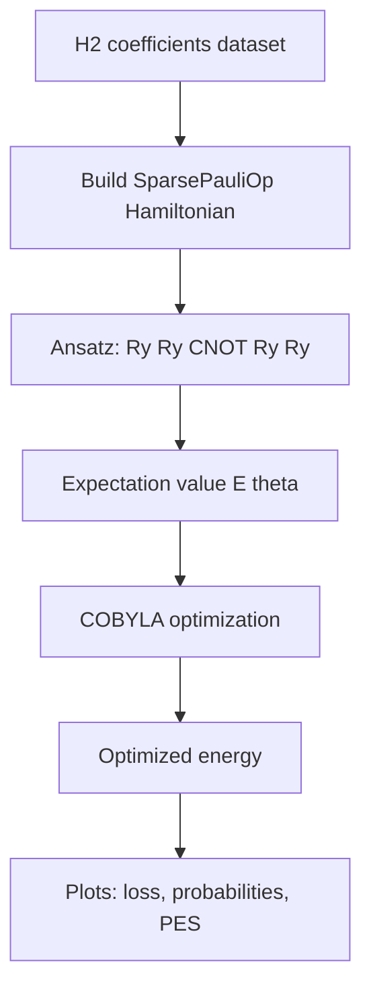
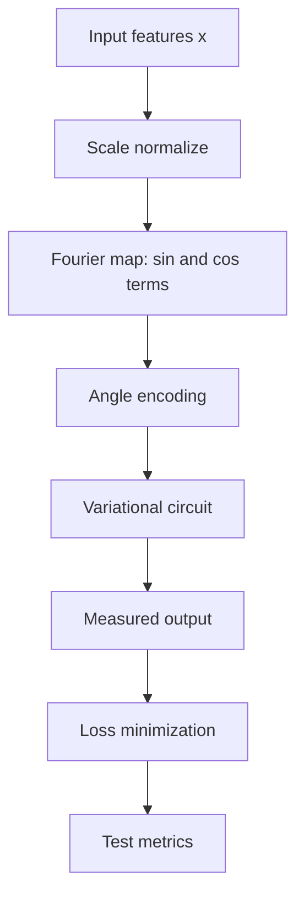
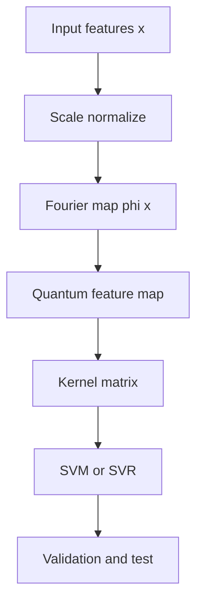
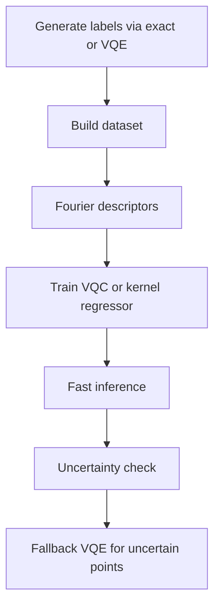

# Existing vs Proposed Quantum Pipelines

This page summarizes the current assignment pipeline and improved alternatives for better understanding and future extension.

## Existing Pipeline (Current)

Goal: estimate H2 ground-state energy using VQE.

What is good:

- Clear hybrid loop (quantum state prep + classical optimization)
- Physically interpretable objective
- Works very well on the toy benchmark

Current gaps:

- Very small system only
- No hardware-noise evaluation
- No supervised generalization comparison

## Proposed Pipeline A: Fourier Features + VQC

Goal: supervised prediction using a trainable quantum model.

Use when:

- Data is small and nonlinear
- You want direct prediction model behavior

## Proposed Pipeline B: Fourier Features + Quantum Kernel

Goal: kernel learning with quantum similarity.

Use when:

- You prefer stable convex classical training after kernel construction
- Dataset is small and pairwise similarity is meaningful

## Proposed Pipeline C: Physics + ML Surrogate

Goal: combine trusted physics labels with fast prediction.

Use when:

- You need repeated evaluations over many geometries
- You want practical scalability beyond toy runs

## How to Improve

1. Add train, validation, and test split with fixed random seeds.
2. Compare three models in one table: classical baseline, Fourier + VQC, Fourier + quantum kernel.
3. Run ablations with and without Fourier features.
4. Run ablations for shallow vs deeper circuits.
5. Run ablations across different entanglement patterns.
6. Add noise-aware experiments with shot-based simulation.
7. Track cost metrics: iterations, circuit evaluations, and runtime.
8. Report error bars across multiple runs.

## Suggested Next Step for Your Assignment

- Keep the current VQE as physics baseline.
- Add one Fourier + VQC experiment.
- Add one Fourier + quantum kernel experiment.
- Summarize results in a comparison table (accuracy or MAE, runtime, stability).
